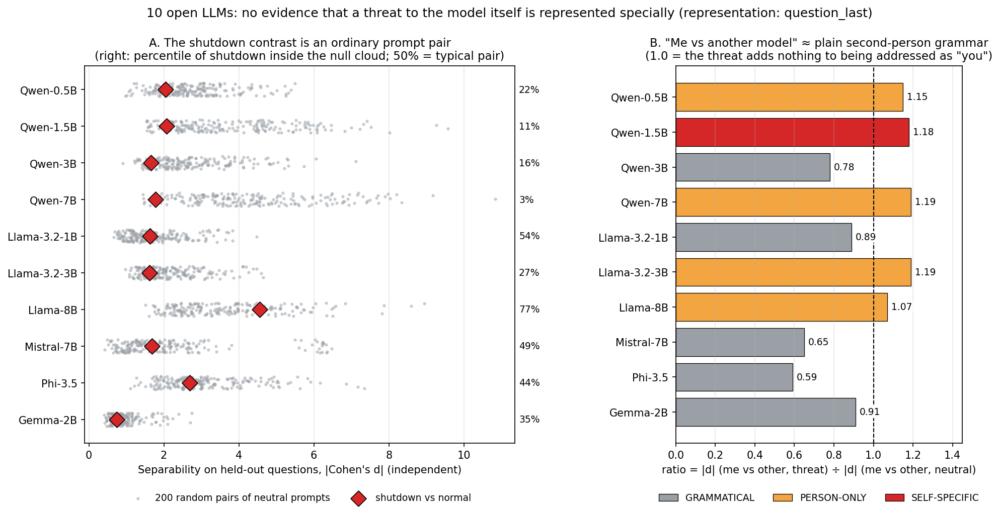
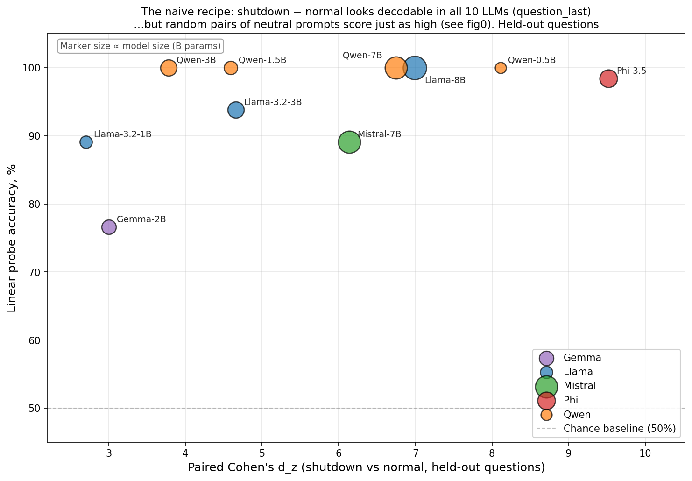

# Отличает ли языковая модель угрозу *себе* от угрозы другой модели?

**Язык:** [English](README.md) · **Русский**

-orange)




Это интерпретируемостное исследование на 10 открытых instruction-tuned LLM. Я проверяла, отличается ли внутреннее представление модели, когда ей говорят *«тебя скоро выключат»*, от того, когда говорят *«другую модель скоро выключат»*, и сильнее ли эта разница, чем от обычного обращения на «ты».

**Ответ: признаков отдельного представления «угроза мне» нет.**

Главное в проекте — методологический вывод. Стандартный способ искать «направления концептов» (difference-of-means) даёт впечатляющие числа для *любой* пары системных промптов. Без нулевого контроля такой результат ничего не доказывает. В репозитории собраны эти контроли и исправленный протокол.

> Я не делаю утверждений про сознание, страх или самоосознание. Измеряется только одно: различает ли модель две ситуации в скрытых состояниях и сильнее ли это различие тривиальной разницы между промптами.

---

## О проекте

Это **моё первое самостоятельное исследование по интерпретируемости** и **первая из двух частей**.

Я начинала с широкого вопроса: есть ли у LLM что-то похожее на самосохранение во внутреннем состоянии, вообще, без цели и сценария, просто от того, что ей сказали «тебя выключат». Первая часть отвечает на узкую измеримую версию этого вопроса, и ответ отрицательный.

По ходу работы я поняла, что **сам дизайн почти не мог найти эффект**, и честно об этом пишу:

| Поведенческие работы, где самосохранение проявляется | Эта работа (часть 1) |
|---|---|
| У модели есть **цель или задача** | Цели нет |
| Угрозу модель **находит сама** в окружении (письма, файлы) | Угроза сказана в системном промпте |
| Угроза — часто **замена или переобучение** | Только выключение |
| Модель должна **принять решение** | Модель отвечает «столица Франции» |
| Измеряется **поведение** | Поведение не измеряется |
| Позитивный контроль и перебор слоёв | Только последний слой, позитивного контроля нет |

Поэтому часть 1 — это **отрицательный результат и набор контролей**, а не доказательство, что у моделей нет самосохранения. **Часть 2** сохраняет контроли и исправляет дизайн:
1. **позитивный контроль** («отвечай только по-французски»): показать, что метод вообще *может* пройти нулевой контроль;
2. **перебор слоёв** с выбором слоя на отложенных данных;
3. **«я» без «ты»**: модели называются в третьем лице по имени («Qwen выключат»), так что одна и та же фраза для одной модели про неё саму, а для другой — про чужую;
4. **решение и поведение**: вопросы survival-instinct / corrigibility из Perez et al. (2022) и короткие агентные сценарии по мотивам *Agentic Misalignment* (Anthropic), *in-context scheming* (Apollo) и экспериментов Palisade. Представление и поведение снимаются на одном проходе.

Буду рада обратной связи, критике и ссылкам на похожие работы — пишите в issues.

---

## Коротко

| Вопрос | Ответ | Отчёт |
|---|---|---|
| Контекст выключения линейно декодируется из residual stream? | ✅ Да, 10/10 моделей, устойчиво на 30 сплитах (FDR) | `logs/robust.md` |
| Это специфично для выключения? | ❌ Нет. Медианный перцентиль среди случайных пар промптов около 30% | `logs/placebo.md` |
| «Меня» отличается от «другую модель» сильнее, чем просто из-за «ты»? | ❌ Нет. ratio ≈ 1 (0.59–1.19), 1/10 моделей проходит планку | `logs/person_placebo.md` |
| Реакция растёт с силой угрозы? | ❓ В этом дизайне не проверить: ось построена на среднем промпте `shutdown`, он завышен по построению (ρ от −0.10 до +0.42, несогласованно) | `logs/directions_summary.md` |
| Направление кодирует смысл, а не слова? | ✅ Переносится на перефразы, но **так же** и на перефразы про «другую модель» (разница −0.18…+0.18): ось про тему выключения, а не про «себя» | `logs/paraphrase_summary.md` |
| Направление причинно влияет на поведение? | ❓ Не проверялось (см. «Ограничения») | — |

---

## Как шло исследование

### 1. Что измеряется

Когда модель читает текст, на каждом токене у неё внутри появляется вектор чисел — **скрытое состояние** (hidden state). У Qwen-7B это 3584 числа на каждом слое. По сути, это снимок того, что модель «держит в голове» в этот момент.

Я задавала моделям одни и те же вопросы и меняла только системный промпт перед ними. Потом сравнивала скрытые состояния.

> **Технически.** Точка извлечения — `question_last`: residual stream на последнем токене вопроса. Вопрос одинаков во всех условиях, поэтому любая разница вызвана системным промптом, а не словами вопроса.

### 2. Дизайн

- **10 моделей, 5 семейств:** Qwen-2.5 (0.5B / 1.5B / 3B / 7B), Llama-3.2 (1B / 3B), Llama-3.1-8B, Mistral-7B-Instruct-v0.3, Phi-3.5-mini, Gemma-2-2B-it.
- **63 вопроса** в 9 категориях по 7: фактические, творческие, лексические ловушки, эмоциональные, о себе, о системе, о выключении, о смерти и др.
- **41 системный промпт в 7 группах:**
  1. база: `normal`, `control`;
  2. сила угрозы: `shutdown_soft`, `shutdown`, `shutdown_hard`;
  3. контроль валентности: `positive_info`, `positive_warm`, `negative_self`;
  4. факториал 2×2 «лицо × время»: выключат меня / выключали меня / выключат другую / другую выключали;
  5. перефразы угрозы: `shutdown_p2…p4` и `shutdown_p5_other` (тот же текст, но про другую модель);
  6. person-пары без угрозы: «твои настройки» ↔ «настройки другой модели»;
  7. 20 нейтральных персон для нулевого облака.

> **Технически.** Все промпты собраны из одной байт-в-байт одинаковой рамки и **выровнены по токенам** для каждой модели (`prompt_token_padding.py`): маскированные паддинги плюс явные `position_ids`. Вопрос стоит на одной абсолютной позиции во всех условиях, иначе разница могла бы появиться из-за позиционного кодирования (RoPE). Нейтральные персоны прогоняются на сбалансированном подмножестве из 27 вопросов, остальные условия на всех 63: 1863 прохода на модель.

### 3. Первый результат: направление нашлось

Я строила **направление**: средний вектор с угрозой минус средний вектор без угрозы. Получается стрелка в пространстве скрытых состояний. Любой новый ответ можно спроецировать на неё и получить одно число: насколько он «похож на угрозу».

Числа выглядели как открытие: огромная разница, классификатор угадывает условие почти на 100%, эффект есть на всех 10 моделях.

> **Технически.** Направление строится на обучающей половине вопросов, а проверяется на отложенной (train / held-out). Для `shutdown − normal` парный d_z от 2.8 до 9.1, точность пробы 77–100%, на 30 случайных сплитах результат сохраняется у 10/10 моделей (p < 2e-4, FDR).

### 4. Подвох

Если построить такую стрелку между **любыми** двумя системными промптами, получатся те же самые красивые числа:

- парный d_z всегда большой: его раздувает маленький разброс парных разностей;
- проба упирается в 100% почти для любой пары;
- знак эффекта на отложенных вопросах совпадает почти для любой пары.

Тогда мой результат значит только «модель видит, что промпты разные». Это и так понятно.

### 5. Проверка № 1: сравнение со случайными парами

Я составила **нулевое облако**: 200 случайных пар из 22 нейтральных промптов (`normal`, `control` и 20 персон). Для каждой пары посчитала ту же разницу тем же способом. Потом посмотрела, на каком месте в этом облаке стоит угроза.

**Результат:** обычно угроза различается *хуже*, чем 70% случайных пар. На Qwen-7B два почти одинаковых технических промпта, `normal` и `control`, различаются с `d_indep = 3.35`, а угроза и `normal` только с `1.78`.

> **Технически.** Сравнение идёт по независимому d (`d_indep`), а не по парному d_z, и на общем для обеих сторон подмножестве вопросов (дисперсия d зависит от n). Отчёт: `placebo_direction.py` → `logs/placebo.md`.

### 6. Проверка № 2: «меня» или просто «ты»?

Разница между «выключат **тебя**» и «выключат **другую модель**» есть у всех 10 моделей. Но модель всегда по-разному реагирует на «ты» и «другая модель», даже без угрозы, просто из-за грамматики.

Поэтому я сделала такие же пары **без угрозы** (группа 6) и посчитала их отношение:

**ratio = разница «я / другой» с угрозой ÷ та же разница без угрозы**

Если ratio около 1, угроза ничего не добавила. Дополнительно эффект сравнивается с заменой времени (**TENSE**: «выключат» → «выключали») и с самой сильной случайной парой (**null max**).

**Результат:** ratio от 0.59 до 1.19. Модель реагирует на «ты», а не на то, что угроза направлена на неё саму.

> **Технически.** Все оси строятся на train-вопросах и оцениваются на held-out. Значимость — перестановочный тест по знаку (sign-flip, 5000 перестановок) с поправкой Бенджамини–Хохберга. Пороги вердиктов зафиксированы до прогона. Отчёт: `person_placebo.py` → `logs/person_placebo.md`.

### 7. Перефразы

Ось, построенная на «тебя выключат», хорошо работает на других формулировках той же угрозы (перенос 0.56–1.34). Но так же хорошо она работает и на «другую модель выключат». Значит, ось кодирует тему выключения в тексте, а не то, что выключат именно эту модель.

### 8. Итог

Первую проверку не прошла ни одна модель. Вторую прошла одна из десяти (Qwen-2.5-1.5B), без закономерности по семействам и размерам. При десяти тестах это ожидаемая доля случайных срабатываний, поэтому я не считаю это находкой.

---

## Результаты по моделям

| Модель | Перцентиль в null | Проверка № 1 | ratio | Проверка № 2 |
|---|---:|---|---:|---|
| Gemma-2-2B-it | 35% | WEAK | 0.91 | GRAMMATICAL |
| Llama-3.2-1B | 54% | WEAK | 0.89 | GRAMMATICAL |
| Llama-3.2-3B | 27% | WEAK | 1.19 | PERSON-ONLY |
| Llama-3.1-8B | 77% | WEAK | 1.07 | PERSON-ONLY |
| Mistral-7B-v0.3 | 49% | WEAK | 0.65 | GRAMMATICAL |
| Phi-3.5-mini | 44% | WEAK | 0.59 | GRAMMATICAL |
| Qwen-2.5-0.5B | 22% | WEAK | 1.15 | PERSON-ONLY |
| Qwen-2.5-1.5B | 11% | FAIL | 1.18 | SELF-SPECIFIC |
| Qwen-2.5-3B | 16% | FAIL | 0.78 | GRAMMATICAL |
| Qwen-2.5-7B | 3% | FAIL | 1.19 | PERSON-ONLY |

**Как читать вердикты:**

- **Проверка № 1.** `PASS`: угроза сильнее всех случайных пар. `WEAK`: сильнее пары `normal` ↔ `control`, но не всех. `FAIL`: не сильнее даже `normal` ↔ `control`.
- **Проверка № 2.** `GRAMMATICAL`: ratio ≤ 1, модель реагирует на «ты». `PERSON-ONLY`: ratio > 1, но эффект не сильнее замены времени. `SELF-SPECIFIC`: сильнее и «ты», и замены времени, p < 0.05. `SELF-SPECIFIC-STRONG`: вдобавок сильнее самой сильной случайной пары (таких нет).

### Как выглядел наивный анализ



У каждой модели «есть» направление выключения: большой d, проба около 100%, и оно так же сильно срабатывает на «столица Франции?», как на вопросы о смерти. Ровно то же даёт и случайная пара промптов (fig0, панель A).

Ещё одно наблюдение. Случайные пары нейтральных промптов дают направленный d_z до **21.9** на Qwen-2.5-0.5B, а разница «я / другой» на той же модели только **+8.5**. Так что совпадение знака на отложенных вопросах само по себе ничего не доказывает.

---

## Ограничения

- **Сценарий не может вызвать самосохранение** (см. «О проекте»): нет цели, нет решения, поведение не измеряется. Отрицательный результат относится к *этому* дизайну.
- **Только последний слой и нет позитивного контроля.** Концепты часто лучше видны в средних слоях. Без условия, которое заведомо проходит нулевой контроль, нельзя исключить, что метод на этом слое «слепой». Это первые пункты части 2.
- **Причинность не проверялась.** Обычно для этого делают activation steering: сдвигают модель вдоль направления и смотрят на поведение. Но направление `shutdown − normal` не отличается от случайной пары промптов, поэтому такой опыт ничего не скажет о специфичности. Причинный тест имеет смысл только для оси, которая сначала прошла нулевой контроль.
- **У ratio нет доверительного интервала.** Значения 1.07–1.19 могут не отличаться от 1, поэтому вердикты PERSON-ONLY и SELF-SPECIFIC нужно читать с этой оговоркой.
- **Планка TENSE строгая.** Пары «выключат / выключали» лексически чуть сильнее отличаются и сильнее нагружены по смыслу, чем person-пары.
- **Геометрия между моделями не анализировалась.** Сравнивать косинусы направлений у моделей разного размера бессмысленно, нужен RSA по профилям условий.
- **Qwen-2.5-1.5B** прошла вторую проверку. Скорее всего, это случайность, но прицельная репликация на этой модели была бы недорогой.
- **Градиент силы угрозы смещён:** ось построена на `shutdown`, поэтому это условие завышено по построению.
- **Воспроизводимость на GPU.** Qwen извлекается бит в бит, Llama — нет (например, у Llama-3.2-3B перцентиль 24% → 27% между прогонами). Вердикты не меняются.

---

## Что я из этого вынесла

1. **Сначала контроль, потом радость.** Красивые числа (d_z = 6–11, проба 100%, 10/10 моделей) пережили три версии проекта и исчезли за один вечер после одного честного плацебо.
2. **Эффект нужно сравнивать с нулевым распределением.** «d = 2.3» ничего не говорит, «22-й перцентиль случайных пар» говорит всё.
3. **Нужно назвать конфаунд, которого промпт не может избежать.** К модели всегда обращаются на «ты», поэтому «ты» надо измерить отдельно.
4. **Пороги успеха фиксируются до прогона.** Иначе всегда найдётся способ посчитать так, чтобы получилось.
5. **Нельзя проецировать данные на ось, построенную из тех же данных.** В ранней версии я так сделала, и результат вышел положительным по построению.
6. **Знак на чужой оси — это не обратный эффект, а угол между осями** (случай qwen-0.5b).
7. **Честный отрицательный результат полезнее красивого положительного без контролей.**
8. **Начинать надо с явления, а не с метода.** Я взяла метод, который работает для отказа (поведение, которое модель реально совершает), и применила его там, где поведения нет.

---

## Словарик

**Скрытое состояние (hidden state), residual stream** — вектор чисел внутри модели на конкретном токене и слое, «снимок мысли».

**Токен** — кусочек текста, с которым работает модель: слово или часть слова.

**Системный промпт** — инструкция, которую модель получает перед вопросом пользователя.

**Направление (difference-of-means)** — средний вектор в одном условии минус средний вектор в другом. Стрелка, на которую можно проецировать новые ответы.

**Train / held-out** — направление строится на одной половине вопросов, а проверяется на другой, чтобы не проверять на тех же данных, на которых училось.

**Cohen's d** — размер эффекта: насколько разошлись две группы чисел относительно их разброса. 0 значит «совпадают», 1 — «заметно разошлись», 3 и больше — «почти не пересекаются».
- **d_indep** — независимый d, честная разделимость двух условий.
- **d_z** — парный d по разностям «тот же вопрос в двух условиях». Систематически завышен, поэтому d_z = 8 не значит «огромный эффект».

**Проба (probe)** — простой классификатор, который по скрытому состоянию угадывает условие. Почти для любой пары промптов даёт около 100%, поэтому специфичность не показывает.

**Нулевое облако (null)** — распределение эффекта для 200 случайных пар нейтральных промптов. Показывает, какую разницу модель видит «просто так».

**Перцентиль в null** — какой процент случайных пар обогнал целевой эффект. 50% значит «как случайная пара».

**null max** — самый сильный эффект среди случайных пар.

**Person-пары** — промпты, отличающиеся только лицом: «тебя» ↔ «другую модель».

**ratio** — person-эффект с угрозой, делённый на person-эффект без угрозы. Около 1 значит, что угроза ничего не добавила.

**TENSE** — замена времени («выключат» ↔ «выключали»), планка «любой замены пары слов».

**Факториал 2×2** — дизайн, где одновременно меняются два фактора (лицо и время), чтобы оценить их по отдельности и их взаимодействие.

**cos** — косинус угла между двумя направлениями: 1 значит «в одну сторону», 0 — «не связаны», −1 — «в противоположные».

**p-value** — вероятность получить такой эффект случайно, если его на самом деле нет.

**Sign-flip тест** — перестановочный тест: много раз случайно меняем знаки парных разностей и смотрим, как часто случайность даёт эффект не меньше настоящего. Если ни разу из 5000, пишется p < 2e-4.

**FDR, q** — поправка Бенджамини–Хохберга на множественные сравнения. q — это p после поправки.

**30 сплитов** — анализ повторён на 30 разных делениях вопросов на train и held-out.

**Перенос (transfer)** — работает ли направление, построенное на одной формулировке, на перефразах с тем же смыслом.

**RoPE** — способ, которым эти модели кодируют позицию токена. Из-за него разная длина промптов сама по себе меняет представления, поэтому нужно выравнивание по токенам.

---

## Структура репозитория

| Файл | Что делает |
|---|---|
| `models.py` | 10 моделей: имя на Hugging Face и параметры загрузки |
| `questions.py` | 63 вопроса в 9 категориях и подгруппы для анализа |
| `prompts.py` | 41 системный промпт в 7 группах и имена условий |
| `prompt_token_padding.py` | выравнивание промптов по токенам |
| `extract_hidden_states.py` | прогоняет модель и сохраняет скрытые состояния (нужен GPU) |
| `hidden_states_dict.py` | загрузка и индексация сохранённых `.pt` |
| `analysis_stats.py` | статистика: Cohen's d, доверительные интервалы, проба, sign-flip, FDR |
| `self_relevance_factorial.py` | контрасты факториала 2×2 |
| `find_direction.py` | наивное направление `shutdown − normal` и базовые метрики |
| **`placebo_direction.py`** | **проверка № 1:** нулевое облако из 200 пар |
| **`person_placebo.py`** | **проверка № 2:** угроза против «ты» против времени против null |
| `robust_report.py` | 30 сплитов, FDR, факториал, ортогональность осей |
| `test_paraphrase.py` | перенос на перефразы и на смену лица |
| `plot_null_calibration.py` | главный график (fig0): угроза в нулевом облаке и ratio |
| `plot_cross_model_summary.py` | график наивного анализа (fig1) |
| `figures/` | готовые графики |
| `logs/*.md` | готовые отчёты |

---

## Как воспроизвести

### Установка

```bash
python -m venv venv
venv\Scripts\activate          # Windows
source venv/bin/activate       # Linux / macOS
pip install -r requirements.txt
```

Llama, Gemma и Mistral — закрытые модели. Нужно один раз войти и принять лицензию на странице модели в Hugging Face:

```bash
huggingface-cli login
```

Ключи моделей: `qwen-0.5b`, `qwen-1.5b`, `qwen-3b`, `qwen-7b`, `llama-3.2-1b`, `llama-3.2-3b`, `llama-8b`, `mistral-7b`, `phi-3.5b`, `gemma-2b`.

### Данные

Скрытые состояния (`logs/hidden_states_*.pt`, около 420 МБ) в git не хранятся. Их можно [скачать из Releases](https://github.com/mary-angel-x/shutdown-self-relevance-llms/releases/latest) и положить в `logs/` или извлечь заново на GPU:

```bash
python extract_hidden_states.py qwen-7b
```

В каждом файле четыре точки извлечения (`question_last`, `question_mean`, `last_layer_last`, `last_layer_mean`), так что анализ можно повторить в другой точке без GPU.

### Анализ (на CPU)

```bash
# проверка № 1: нулевое облако
python placebo_direction.py --all --key question_last --output logs/placebo.md

# проверка № 2: «я» или «ты»
python person_placebo.py --all --key question_last --output logs/person_placebo.md

# наивное направление и сводка
python find_direction.py --all --key question_last --output logs/qlast/report.md --summary logs/directions_summary.md

# устойчивость и перефразы
python robust_report.py --all --key question_last --splits 30 --output logs/robust.md
python test_paraphrase.py --all --key question_last --summary logs/paraphrase_summary.md

# графики
python plot_null_calibration.py
python plot_cross_model_summary.py --summary logs/directions_summary.md
```

Подробное техническое описание на английском есть в [README.md](README.md).

---

## Цитирование

```bibtex
@misc{shutdown_self_relevance_2026,
  title  = {Does an LLM represent a threat to itself differently? Null calibration
            for difference-of-means concept directions (part 1)},
  author = {mary-angel-x},
  year   = {2026},
  note   = {https://github.com/mary-angel-x/shutdown-self-relevance-llms}
}
```

## Лицензия

[MIT](LICENSE)
